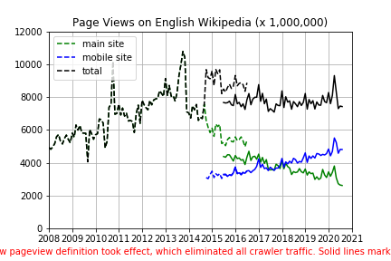

# A1: Data Curation

The goal of this assignment is to construct, analyze, and publish a dataset of monthly traffic on English Wikipedia from January 1 2008 through August 30 2020. All analysis is performed in a single Jupyter notebook and all data, documentation, and code is published in a single GitHub repository. The purpose of this assignment is to make the project fully reproducible by others: from data collection to data analysis.

## Data

Data is collected from two different API endpoints, the Legacy Pagecounts API and the Pageviews API:

* The Legacy Pagecounts API ([documentation](https://wikitech.wikimedia.org/wiki/Analytics/AQS/Legacy_Pagecounts), [endpoint](https://wikimedia.org/api/rest_v1/#/Pagecounts_data_(legacy)/get_metrics_legacy_pagecounts_aggregate_project_access_site_granularity_start_end)) provides access to desktop and mobile traffic data from December 2007 through July 2016.

* The Pageviews API ([documentation](https://wikitech.wikimedia.org/wiki/Analytics/AQS/Pageviews), [endpoint](https://wikimedia.org/api/rest_v1/#/Pageviews_data/get_metrics_pageviews_aggregate_project_access_agent_granularity_start_end)) provides access to desktop, mobile web, and mobile app traffic data from July 2015 through last month.

Data is available under the [Creative Commons Attribution-ShareAlike License](https://creativecommons.org/licenses/by-sa/3.0/) with additional terms. See [Terms and Conditions](https://www.mediawiki.org/wiki/Wikimedia_REST_API#Terms_and_conditions)

## Output

The [csv file](en-wikipedia_traffic_200801-202008.csv) generated after combining both data sources has the following columns:

| Column                  | Description                                                                     |
|-------------------------|---------------------------------------------------------------------------------|
| year                    | YYYY                                                                            |
| month                   | MM                                                                              |
| pagecount_all_views     | Sum of all views from Pagecounts API (legacy) for a specific month.             |
| pagecount_desktop_views | Total desktop views from Pagecounts API (legacy) for a specific month.          |
| pagecount_mobile_views  | Total mobile views from Pagecounts API (legacy) for a specific month.           |
| pageview_all_views      | Sum of all views from Pageviews API for a specific month.                       |
| pageview_desktop_views  | Total desktop views from Pageviews API for a specific month.                    |
| pageview_mobile_views   | Sum of mobile app and mobile web views from Pageviews API for a specific month. |

## Visualization

## Packages
The following packages are used:

1. [json](https://docs.python.org/3/library/json.html)
2. [requests](https://requests.readthedocs.io/en/master/)
3. [Pandas](https://pandas.pydata.org/)
4. [Numpy](https://numpy.org/) 
5. [Matplotlib](https://matplotlib.org/)

## License
[MIT License](https://opensource.org/licenses/MIT) was used for this project.
